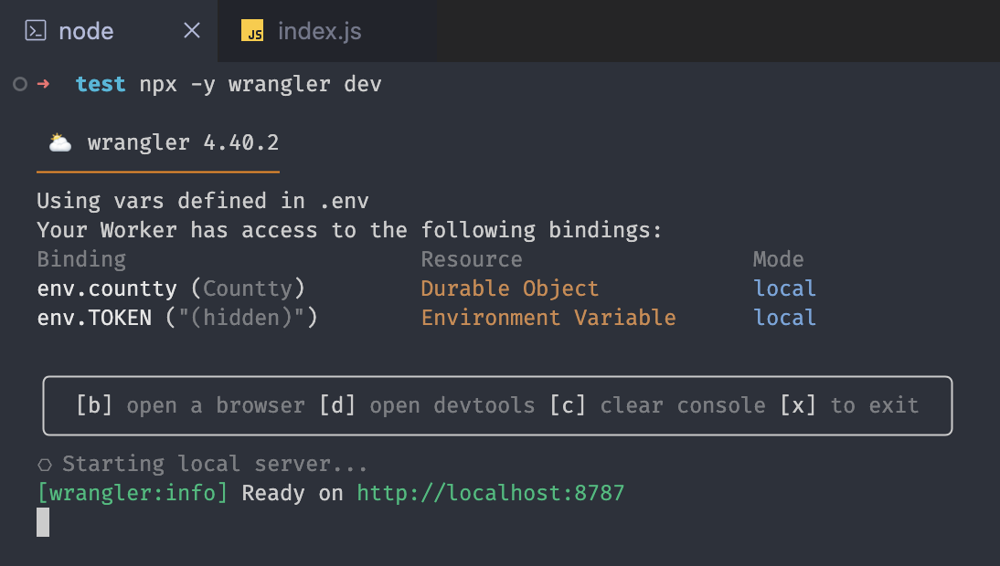

<div align="center">
  <h1>Countty ✚</h1>
  <p>Easily persist your own <b>Page View Counter</b> for free.</p>
</div>

---

- Based on [**Durable Objects**](https://developers.cloudflare.com/durable-objects/) and ready for use via [**Cloudflare Workers**](https://developers.cloudflare.com/workers/) ⛅️
- No **VPS** or **Database** plans required 💳
- No need to configure servers or databases ✨

---

## 🧪 Quick Test Locally

You can test it locally, even if you don't have a [**Cloudflare**](https://dash.cloudflare.com/) account.

### 📦 Install

```sh
npm i countty
```

### ⛅️ Worker

Create the files:

- `index.js`

```js
import { createCountty } from 'countty';

const { Worker, Countty } = createCountty();

// Worker Routes
export default Worker;

// Durable Object (SQLite)
export { Countty };
```

- `wrangler.json`

```json
{
  "main": "index.js",
  "compatibility_date": "2025-09-24",
  "compatibility_flags": ["nodejs_compat"],
  "durable_objects": {
    "bindings": [
      {
        "name": "countty",
        "class_name": "Countty"
      }
    ]
  },
  "migrations": [
    {
      "tag": "v1",
      "new_sqlite_classes": ["Countty"]
    }
  ]
}
```

### 🏁 Run

```sh
npx -y wrangler dev
```

> **Example**:
>
> 

You can also install [**wrangler**](https://www.npmjs.com/package/wrangler) as a development dependency:

```sh
npm i -D wrangler
```

---

### 🔗 API Routes

> [!IMPORTANT]
>
> By default, the token for private routes is `"123456"`. To change it, follow the steps in the next section.

#### `/create`

- Creates a new counter from the slug/
- Type: **private**.

>

```js
fetch('http://localhost:8787/create?slug=test', {
  headers: {
    Authorization: 'Bearer 123456',
  },
})
  .then((res) => res.json())
  .then(console.log);
```

#### `/views`

- Increments a view and returns the number of views for the specified slug.
- Returns `0` when the slug does not exist.
- Type: **public**.

```js
fetch('http://localhost:8787/views?slug=test')
  .then((res) => res.json())
  .then(console.log);
```

#### `/backup`

- Performs a complete backup of the **Countty Durable Object** and returns the **SQL** dump as plain text.
- Type: **private**.

```js
fetch('/backup', {
  headers: {
    Authorization: 'Bearer 123456',
  },
})
  .then((res) => res.text())
  .then(console.log);
```

---

## 🔐 Production Usage

For production use, you will need a [**Cloudflare**](https://dash.cloudflare.com/) account to proceed.

### ⛅️ Create your worker

```sh
npx wrangler deploy
```

### 🔑 Personalize your Token

To use in production, please create your personal token:

```sh
npx wrangler secret put TOKEN # Then press `Enter` to insert your token
```

> [!TIP]
>
> Create an `.env` file with the `TOKEN` variable to use the same token locally.

### 🐬 SQL Options

You can change the table name by specifying the name when creating **Countty**:

```js
import { createCountty } from 'countty';

const { Worker, Countty } = createCountty({ table: 'my-table' });

// Worker Routes
export default Worker;

// Durable Object (SQLite)
export { Countty };
```

---

## ⚖️ Restrictions on the free plan:

- **Workers:** https://developers.cloudflare.com/workers/platform/pricing/
- **Durable Objects (SQLite):** https://developers.cloudflare.com/durable-objects/platform/pricing/
